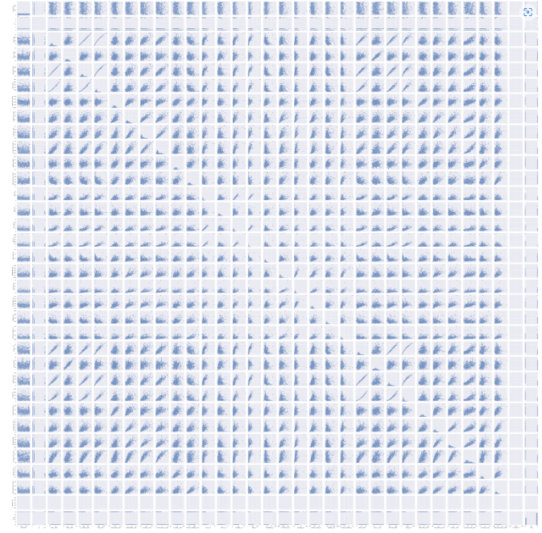
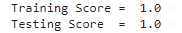
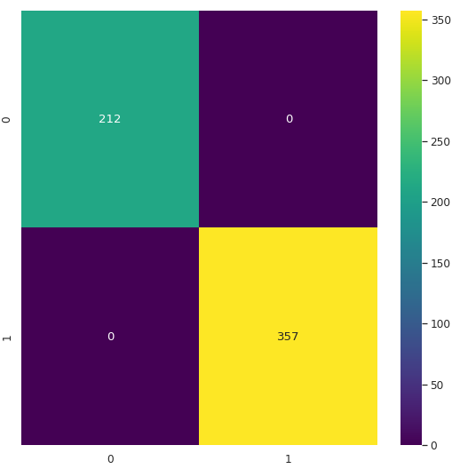
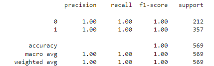

# Breast Cancer
My target in this project is to build an machine learning model to predict whether a tumor is malignant or benign.
# Used Libraries
- Pandas
- Seaborn
- Matplotlib
- Sklearn
- Warnings
# Pairplot

#### From the shapes of the features i used decision tree classifier model in the stage of building ML model.

# Training and Testing Score

# Confusion Matrix

# Classification Report

